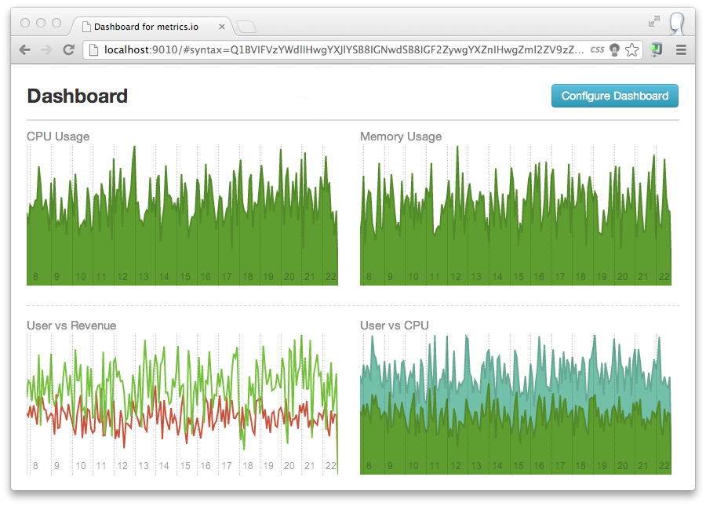

minum-dashboard
========================

Dashboard for visualize and correlate metrics tracked via [minum](http://minum.io)

## Design Decisions

* Cloud Ready - Easily deployable into cloud
* Portable - Run as a standalone app locally
* Embeddable - Easily embed into existing `nodejs` webapp

## Dependencies

* Mongodb (2.1+)
* NodeJs

## Accessing Dashboard 

There are few ways you can access the dashboard.

### 1. Standalone App

##### Install `minum-dashboard` binary via `npm`
    npm install minum-dashboard -g

##### Start Dashboard
    minum-dashboard -m <mongodb url>

### 2. Deploy into Cloud

You can deploy dashboard into popular cloud providers in few minutes. First **download** or **clone** this repository into your local machine.

#### Heroku

* You can deploy dashboard into heroku as you do with [other apps](https://devcenter.heroku.com/articles/nodejs)
* But first edit `conf/config.json` for `basic-auth` settings and `mongo-url`
* If you are thinking to use [mongodb addon on heroku](https://devcenter.heroku.com/articles/mongolab#adding-mongolab-to-your-heroku-app), add it first and get the `mongo-url` and configure it with `conf/config.json`

### 3. Deploy as a `nodejs` app manually

* This repository is a deployable nodejs app and can be deployed as a typical `nodejs` app.
* By default dashboard runs with `basic-auth` and can be configured at `/conf/config.json`
* But it is recommend to run dashboard behind `nginx` with `ssl` and `basic_auth`.
* You can configure `port` and `mongo-url` in `/conf/config.json`
* After that run `start-dashboard.js` with nodejs
	
	node start-dashboard.js

### 4. Embed with an existing `express` webapp

~~~js
var express     = require('express');
var dashboard   = require('minum-dashboard');
var webapp      = express();

var MONGO_URL = "mongodb://localhost/test";
dashboard.listen(MONGO_URL, webapp, { prefix: '/metrics'});

webapp.listen(5005);
~~~

## Using Dashboard

Inside the Dashboard you can create as many graphs as you need. You can correlate metrics too. (use area chart type)

There is no UI for defining graphs. But we have simple and flexible syntax to define them. 
>We simply did no use JSON since, it is too heavy for taking user inputs 

#### Syntax

Here is how you define a graph. 

    <title for graph> | <graph-type> | <metric-name> | <value-aggregator>, <source-aggregator> | <resolution> | <time-length> | <list of sources - optional >

eg:- `CPU Usage | area | cpu | avg, sum | five_secs | 1000 * 60 * 15 | source1, source2`

* Supported values for `graph-type` : `area`, `line`
* Supported values for `value-aggregator` : sum, avg, min, max
* Supported values for `source-aggregator` : sum, avg, min, max
* Supported values for `resolution` : five_secs, minute, hour, day
* You can use multiple lines to specify multiple graphs
* Empty lines add empty block to dashboard instead of the graph

### Permalink URLs

* Configuration you do will be saved in the URL. 
* So you can simply copy URL and share with others.
* You can http://bit.ly or http://goo.gl to shorten the URL
